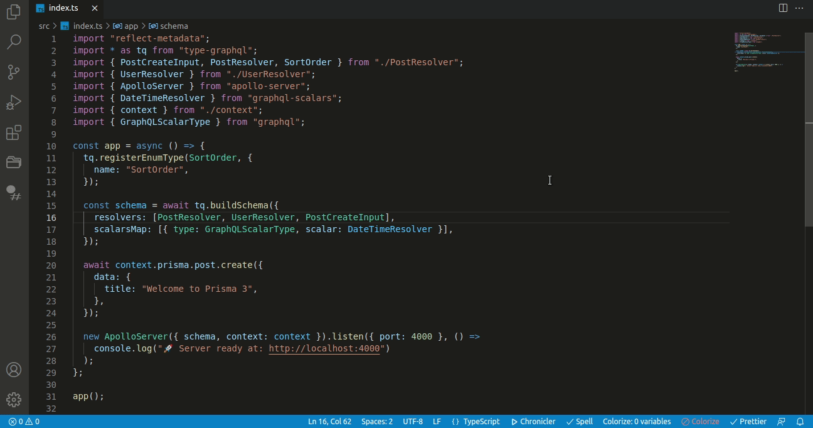
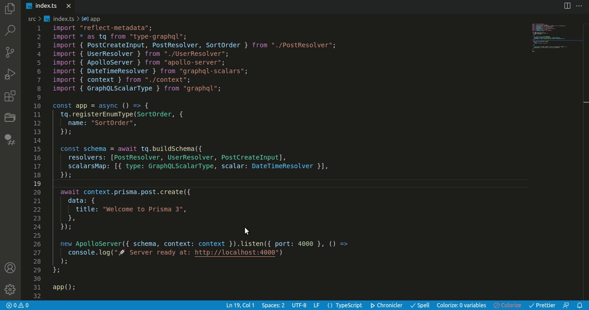

# Breakpoint Bookmarks

The Breakpoint Bookmarks extension will help you enhance your debugging workflows, by creating and maintaining separate breakpoints files, and load them as necessary, in their original locations. It supports all language supported by vsCode.

# Installation

Simply run this `ext install OmarDulaimi.breakpoint-bookmarks` in the command palette or search for `Breakpoint Bookmarks` in extensions menu.
## Features

### Save Current Breakpoints

After setting your breakpoints through your project, open the command palette and run the command `Breakpoint Bookmark: Save Current Breakpoints`. You can find the newly saved breakpoints flow in the extension menu.

 

### Load A Saved Breakpoint File

Once you have at least one breakpoints flow saved, you can load it by opening the extension menu, then hover to click the icon on the right of the flow you want to load.

 

## Extension Settings

This extension contributes the following settings:

- `breakpointBookmark.clearPreviousBreakpoints`: Clears previous active breakpoints when loading a new file
- `breakpointBookmark.saveLocation`: Specifies the folder path where the breakpoint files will be stored in
